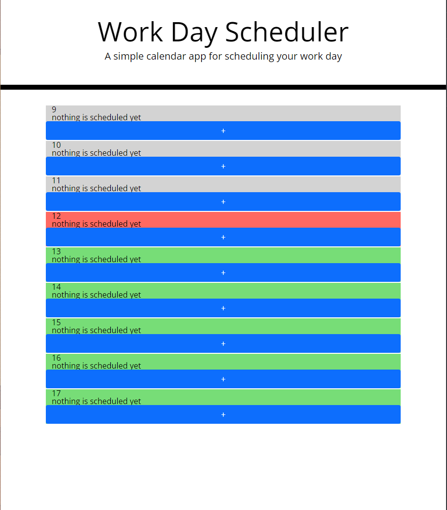

Homework 5
----------
## Day calendar

The purpose of this day calendar is to create a plan for the day.

the calendar should have rows for each our that are labeled with the hours, have a textbox to display what is planned for those hours and a button to add an event or task to that hour.

I decided to go with a script that auto populates the calendar based on a variable array of working hours.

I also decided to use a modal that pops up for entering in the hour's task

